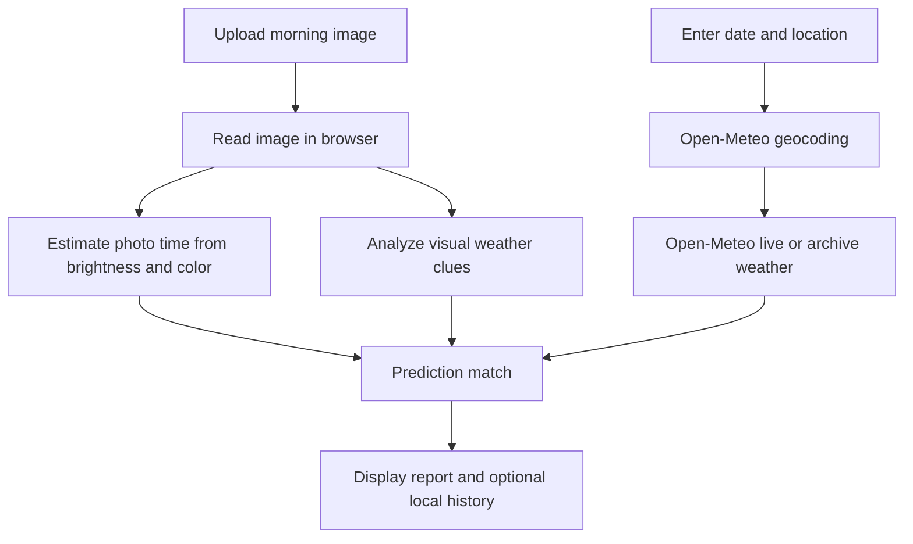

# Good morning Ji 


## Basic Details
### Team Name: BJP interns


### Team Members
- Team Lead: Harikrishnan K R - GEC Thrissur
- Member 2: Sebastian T D - GEC Thrissur

### Project Description
Good Morning Ji is a web application for checking the veracity of the good morning messages sent by uncles in family group chats. It compares visual clues in an uploaded morning image with live or historical weather data for the selected location.

### The Problem (that doesn't exist)
The problem was to determine whether a daily “good morning” image actually represents a morning scene and whether its visible weather matches the real conditions.

### The Solution (that nobody asked for)
The application analyzes an uploaded image for brightness, color balance, cloud cover, rain likelihood, temperature, visibility, and an approximate photo time. It then compares those estimates with Open-Meteo weather data and produces an explainable prediction-match score.

## Technical Details
### Technologies/Components Used
For Software:
- Languages: TypeScript, HTML, CSS
- Frameworks: React with Vite
- Libraries and services: React DOM, Open-Meteo Geocoding API, Open-Meteo Forecast API, Open-Meteo Archive API, optional vision-analysis endpoint, browser Canvas API
- Development tools: npm, TypeScript compiler, Oxlint, Git, Visual Studio Code

### Implementation
Good Morning Ji is implemented as a React and TypeScript web application. Users upload a JPG, PNG, or WEBP morning image, and start an analysis. The browser estimates an approximate photo time from image brightness and color cues. Weather data is retrieved from Open-Meteo for the selected location and date. If `VITE_VISION_API_URL` is configured, the image can also be sent to a vision-analysis service; otherwise, the application uses a local canvas-based visual fallback. The interface displays the image prediction, recorded weather, comparison details, and a match score. Reports can be saved to browser local storage.

## Installation

```bash
git clone <repository-url>
cd good_morning_weather
npm install
```

## Run

```bash
npm run dev
```

The development server is normally available at `http://localhost:5173`.

### Optional Vision API Configuration

Create a `.env` file in the application root if a compatible image-analysis service is available:

```env
VITE_VISION_API_URL=https://your-vision-service.example/analyze
```

When this variable is omitted, the local visual fallback keeps the application usable without an API key.

### Project Documentation

The application workflow is:

1. Upload a morning image.
2. Estimate the image time from visual light and color cues.
3. Resolve the selected location using Open-Meteo geocoding.
4. Retrieve live or historical weather data.
5. Compare the image prediction with recorded weather.
6. Save completed reports to local browser history.

## Screenshots


## Workflow Diagram



The browser performs the local visual fallback; weather data is supplied by Open-Meteo.

For Hardware:

This is a software-only project. No hardware components, circuit, schematic, or build photos are required.

## Schematic & Circuit

Not applicable: the project does not use electronic hardware.

## Build Photos

Not applicable: the deliverable is a browser-based application.

### Project Demo
## Video

No public demo video link has been published yet. A demo should show image upload, automatic photo-time estimation, weather retrieval, prediction comparison, and report history.

## Additional Demos

No additional demo materials are currently published.

## Team Contributions
- Harikrishnan K R: Project concept, team coordination, testing, and documentation.
- Sebastian T D: React application implementation, visual prediction flow, weather API integration, and UI work.

---
Made with ❤️ at TinkerHub Useless Projects 


